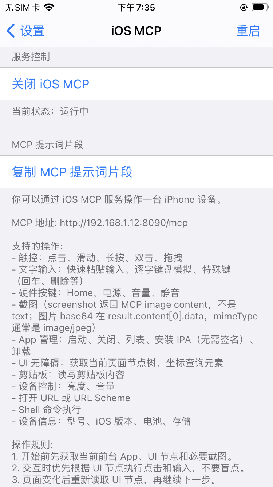

# iOS MCP

中文 | [English](README_EN.md) 

iOS MCP 是一个运行在越狱 iPhone 上的 [MCP (Model Context Protocol)](https://modelcontextprotocol.io) 服务器，让 AI 代理（Claude、Codex、Cursor 等）能够直接操控 iOS 设备。

## 功能概览

| 类别 | 工具 | 说明 |
|------|------|------|
| **触控手势** | `tap_screen` `swipe_screen` `long_press` `double_tap` `drag_and_drop` | 精确屏幕坐标操作 |
| **硬件按键** | `press_home` `press_power` `press_volume_up` `press_volume_down` `toggle_mute` `wake_and_home` | HID 模拟物理按键，锁屏/熄屏唤醒 |
| **文字输入** | `input_text` `type_text` `press_key` | 剪贴板快速输入 / HID 逐字模拟 / 特殊键 |
| **截图** | `screenshot` `get_screen_info` | Base64 JPEG 截图、屏幕尺寸与方向 |
| **App 管理** | `launch_app` `kill_app` `list_apps` `list_running_apps` `get_frontmost_app` `install_app` `uninstall_app` | 启动/关闭/安装/卸载 App |
| **无障碍** | `get_ui_elements` `get_element_at_point` | 获取 UI 节点树、坐标元素查询 |
| **剪贴板** | `get_clipboard` `set_clipboard` | 读写剪贴板内容 |
| **设备控制** | `get_brightness` `set_brightness` `get_volume` `set_volume` | 亮度、音量 |
| **设备信息** | `get_device_info` | 型号、iOS 版本、电池、存储、内存、越狱方式 |
| **URL** | `open_url` | 打开链接或 URL Scheme |
| **Shell** | `run_command` | 执行 Shell 命令 |

共 **34** 个 MCP 工具，覆盖 iOS 设备自动化的主要场景。

## 运行要求

- 越狱 iOS 设备

## 安装说明

### 支持环境

| 越狱类型 | 支持系统版本 | 包架构 |
|------|------|------|
| `rootful` | iOS 13 - iOS 18 | `iphoneos-arm` |
| `rootless` | iOS 15 - iOS 18 | `iphoneos-arm64` |
| `roothide` | iOS 15 - iOS 18 | `iphoneos-arm64e` |

### 安装方式

#### 方式一：从 Release 页面下载安装包

请根据越狱类型选择上表对应架构的 deb 包。

手动安装时请注意以下依赖：

- `mobilesubstrate/ElleKit`
- `preferenceloader`

#### 方式二：通过 Cydia / Sileo 直接安装

可在以下包管理器中直接搜索并安装：

- `Cydia`
- `Sileo`

搜索名称：

- `iOS MCP`

### 安装完成后建议执行以下检查

1. 重启一次 `SpringBoard`
2. 浏览器访问：

```text
http://设备IP:8090/health
```

3. 返回以下内容表示服务启动正常：

```json
{"status":"ok","server":"ios-mcp","version":"1.1.0"}
```

## 使用

安装后打开设备「设置」→「iOS MCP」，启动服务后点击「复制 MCP 提示词片段」，将其粘贴到你的 AI 提示词中即可。

<p align="center">
  
</p>


## 安全说明

- MCP 服务无内置认证，建议仅在局域网环境下使用
- 锁屏或熄屏时，服务端会拦截点击、滑动、输入、启动 App、Shell 等交互/写入类工具，只放行状态查询、截图和唤醒恢复类工具
- `run_command` 工具可执行任意 Shell 命令，请谨慎使用
- `mcp-root` 提供 root 提权能力，仅限包内工具使用

## 社区交流

`iOS MCP` 已经聚集了不少开发者和用户持续交流，目前已建立多个微信交流群。

| 微信交流群（6群开放中） | 公众号 |
|---|---|
| 1群：已满<br>2群：已满<br>3群：已满<br>4群：已满<br>5群：已满<br>6群：开放中 | `移动端Android和iOS开发技术分享` |
|  |  |

> 6群二维码如已过期，请添加微信 `witchan028` 或关注公众号 `移动端Android和iOS开发技术分享` 获取最新入群方式。

欢迎添加微信或关注公众号，获取最新动态与入群方式。

- 微信：`witchan028`
- 邮箱：`witchan028@126.com`

## 作者

**witchan**

## 许可

本项目自有代码使用 MIT License，详见 [LICENSE](LICENSE)。

使用、修改、分发或合并本项目自有源码及其重要部分时，应保留版权声明和许可证文本。[NOTICE](NOTICE) 提供项目出处和免责说明。

本项目按 “AS IS” 方式提供，不提供任何明示或暗示担保。因使用、修改、分发、部署或运行本项目导致的设备异常、数据丢失、服务中断、账号风险、系统损坏、安全问题、商业损失或其他直接/间接影响，作者不承担责任。

项目中包含的第三方组件（如 AppSync Unified、appinst、ldid、OpenSSL、libplist、libzip）遵循各自的开源协议，详见 [THIRD_PARTY_NOTICES.md](THIRD_PARTY_NOTICES.md)。
